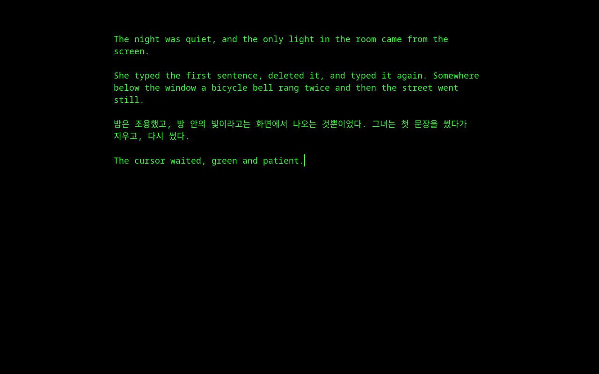
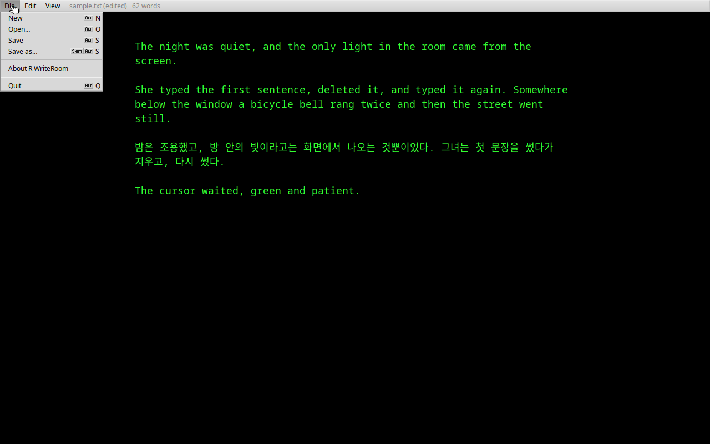

# R WriteRoom pour Haiku

[English](README.md) · [한국어](README.ko.md) · [日本語](README.ja.md) · [Italiano](README.it.md) · [Français](README.fr.md)

Écrire en plein écran, sans distraction : des lettres vertes et un curseur vert sur une page noire, rien d'autre. Le menu reste caché tant que vous n'amenez pas le pointeur en haut de l'écran.

- Amenez le pointeur au **bord supérieur** pour faire descendre le menu : nouveau, ouvrir, enregistrer, enregistrer sous, texte plus grand ou plus petit, quitter. Éloignez-le et le menu disparaît. **Échap** le garde affiché ou le cache.
- La barre de menus indique aussi le nom du fichier, s'il reste des modifications non enregistrées, et le nombre de mots.
- Les raccourcis fonctionnent même menu caché : **Alt+N** nouveau, **Alt+O** ouvrir, **Alt+S** enregistrer, **Maj+Alt+S** enregistrer sous, **Alt+Q** quitter, **Alt+Plus/Moins** taille du texte.
- Les fichiers sont du texte brut UTF-8. Quitter avec des modifications non enregistrées demande d'abord confirmation.
- Menus en anglais, italien, coréen et japonais, selon les préférences Locale.

## Installation

| Haiku | Commandes |
| --- | --- |
| x86 32 bits (x86_gcc2) | `pkgman add-repo https://pkgman.rainygirl.com/x86_gcc2` `pkgman install rwriteroom_x86` |
| x86_64 | `pkgman add-repo https://pkgman.rainygirl.com/x86_64` `pkgman install rwriteroom` |
| arm64 (RENKU) | `pkgman install rwriteroom` |

Lancez ensuite **R WriteRoom** depuis Deskbar → Applications, ou ouvrez un fichier texte avec le menu **Open with** de Tracker.

## Licence

MIT

## Utilisation de l'IA

Certaines parties de R WriteRoom ont été développées avec l'aide d'outils de programmation à base d'IA (Claude d'Anthropic). Tout le code a été relu et testé par l'auteur.
